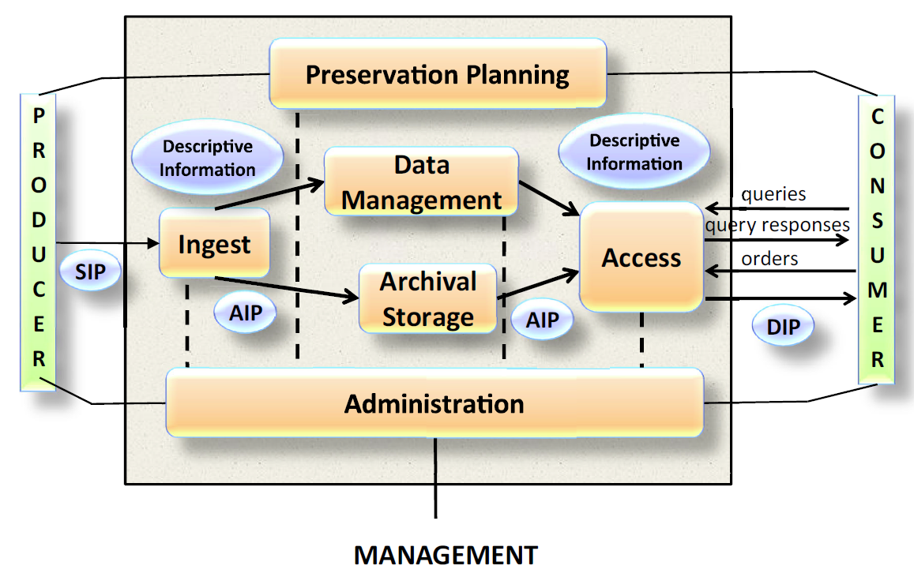
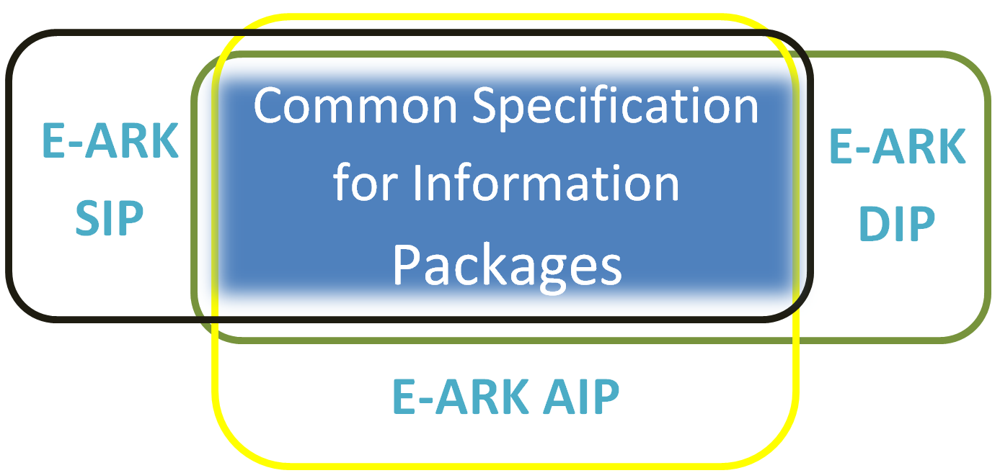
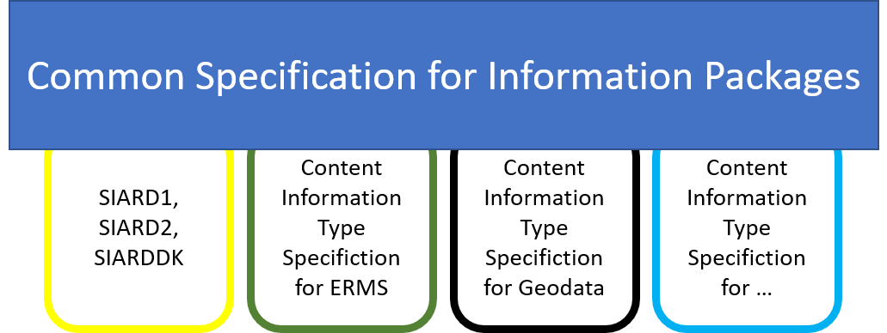

# 1 Introduction
This document introduces the concept of a Common Specification for Information Packages. It aims to serve three main purposes:

1.	Establish a common understanding of the requirements which need to be met in order to achieve interoperability of Information Packages;

2.	Establish a common base for the development of more specific Information Package definitions and tools within the digital preservation community;

3.	Propose the details of an XML-based implementation of the requirements using, to the largest possible extent, standards which are widely used in international digital preservation.

Ultimately the goal of the Common Specification for Information Packages (CS IP) is to reach a level of interoperability between all Information Packages so that tools implementing the CS IP can be taken up by institutions without needing further modifications or adaptations.

## 1.1 The Common Specification for Information Packages and OAIS
In the OAIS  framework three types of Information Packages (IPs) are present in a digital preservation ecosystem: Submission Information Packages (SIPs), Archival Information Packages (AIPs) and Dissemination Information Packages (DIPs) ([Figure 1](#fig1)). These three IP types are respectively used to
submit data and metadata to digital repositories; store it in long-term preservation facilities; and deliver to consumers.

**Figure 1:** OAIS Functional Entities and Information Packages

This Common Specification for Information Packages aims to summarise the common aspects of all these IPs. The main goal in the development of this specification has been to identify and standardise the common aspects of IPs which are equally relevant and implemented by any of the functional entities of the overall digital preservation process presented in OAIS (i.e. pre-ingest, ingest, archival storage, data management and access). The practical implementation is that the specification therefore allows for the development of generic tools and code libraries which can either be applied commonly across the whole lifecycle of digital data, or be reused as the basis for developing more specific, content or process-aware tools.

However, to allow for interoperability on process level there is still a need for defining more detailed technical specifications for a SIP, AIP and DIP. This is also the case for the E-ARK specifications where, next to this Common Specification for Information Packages, more detailed E-ARK SIP, E-ARK AIP and E-ARK DIP profiles  have been created.

**Figure 2:** The scope of Common Specification for Information Packages in regard to OAIS Information Packages.

In general, the E-ARK SIP and E-ARK DIP specifications reuse and apply fully all the requirements set in this Common Specification. However, they also extend it with aspects relevant only for the respective processes ([Figure 2](#fig2)).

For example, the E-ARK SIP specification extends the CS IP with further requirements about recording relevant information on a submission agreement and the actors of the submission process. On the other hand, the E-ARK DIP provides possibilities for describing complex access environments needed to reuse the content of a DIP.

Regarding the E-ARK AIP format, it is important to note that it does not extend the CS IP in the same way the E-ARK SIP and E-ARK DIP formats do, i.e. in the sense of a format specification inheriting all general properties from the CS IP which is then augmented by specific AIP requirements. The reason for this is that while the SIP and the DIP are like "snapshots" in time – one capturing the state of an information package at time of submission (SIP), the other one capturing one form of delivery of the information for access (DIP)
– then the AIP needs to deal with an “evolving object” which is constantly updated by preservation actions undertaken in the course of the objects life-cycle. As such, while the E-ARK AIP specification does implement all of the core metadata requirements defined in the Common Specification and extends these (for example it describes a means to record preservation actions about the IP), it does also extend the default structure of the CS IP (defined in [Section 4](../implementation/structure/)). Essentially the AIP introduces a more complex structure which allows at the same time to securely hold an E-ARK SIP (which itself follows in full the CS IP) and at the same time add and modify additional representations over a series of preservation actions.

## 1.2 The Common Specification for Information Packages and Content Information Type Specifications
As an interoperability standard, it must be possible to use the CS IP regardless of the type and format of the content users need to handle. At the same time, each individual content type and file format can have specific characteristics which need to be taken into account for purposes of validation, preservation and curation.

To allow for such in-depth control over specific content types and formats, E-ARK specifications introduce the concept of Content Information Type Specifications.  A Content Information Type Specification can include detailed requirements on how content, metadata, and documentation for specific content types (for example relational databases or geospatial data) have to be handled within a CS IP (or E-ARK SIP, AIP or DIP).

For now (February 2017) there are seven Content Information Type Specifications which have been created by the E-ARK project and have been verified for usage within the Common Specification for Information
Packages:

- SMURF SFSB: Semantically Marked-Up Records Format for Simple File-System Based records. This Content Information Type Specification describes the usage of the CS IP for the case of simple computer files organised in folder structures; and their description using the EAD encoding standard ;

- SMURF ERMS: Semantically Marked-Up Records Format for Electronic Records Management Systems. This Content Information Type Specification describes the use of the CS IP for the archiving of records exported from ERMS-type systems. The specification is built on top of SMURF SFSB and extends it with additional metadata requirements for ERMS-derived metadata;

- GeoVectorGML and GeoRasterGeoTIFF: These two Content Information Type specifications build upon the SMURF SFSB and add additional structural and metadata requirements for storing geospatial information, respectively in GML  and GeoTIFF  formats, within a CS IP compatible Information Package;

- SIARD1, SIARD2 and SIARDDK: These three Content Information Type specifications describe the usage of the CS IP for the archiving, preservation and reuse of relational databases in one of the formats in the SIARD family (Software Independent Archiving of Relational Databases). Note, that SIARD1 and SIARDDK specifications are deemed outdated by the time of writing and are only intended to be used for packaging already available SIARD1 and SIARDDK packages in a CS IP compatible Information Packages. For new occurrences of archiving relational databases the use of the SIARD2 format  and according Content Information Type Specification is recommended.

**Figure 3:** Common Specification for Information Packages and Content Information Type Specifications

The total number of Content Information Type specifications is, however, unlimited and the long-term commitment of the DILCIS Board  is to keep the overall environment open and inclusive. As such, interested bodies are welcome to develop their own Content Information Type Specifications, for example
for 3D building projects or electronic publications. An appropriate management regime to facilitate the creation and approval of additional Content Information Type specifications by anyone in the broader community is implemented by the DILCIS Board.

For more detailed information about the Content Information Type specifications please look also at [Section 6.1](../implementation/metadata/premis/) below and check www.dilcis.eu!

## 1.3 Common Specification for Information Packages, OAIS Information Packages’ specifications and Content Information Type Specifications

Following the discussions in the previous two Sections we can state that the overall ecosystem of E-ARK Common Specifications consists of 3-layers ([Figure 4](#fig4)):

- The current document, the Common Specification for Information Packages, is the core which provides guidance which must be followed regardless of the process, data or lifecycle stage;

- The E-ARK SIP, AIP and DIP build on the CS IP and extend it with specific process-related aspects;

- The Content Information Type Specifications define detailed requirements for embedding and describing specific content types within a CS IP.

**Figure 4:** Relations between the Common Specification for Information Packages; E-ARK SIP, AIP and DIP specifications; and Content Information Type Specifications

Therefore the “thing encountered in the wild” is the E-ARK SIP, AIP or DIP including data according to one or many Content Information Type Specifications.

## 1.4. Relation to other documents
This Common Specification for Information Packages is related to the following documents:

### International standards and best-practices
- Reference Model for an Open Archival Information System (OAIS), 2012,
public.ccsds.org/publications/archive/650x0m2.pdf
This specification has used the same terminology as introduced in the OAIS model and also the same division of information package types: Submission Information Package (SIP), Archival Information Package (AIP), Dissemination Information package (DIP).

- Producer-Archive Interface Specification (PAIS) – CCSDS, 2014,
public.ccsds.org/publications/archive/651x1b1.pdf
We have investigated the structure of a SIP presented in PAIS, but as the implementation of this specification is not very comprehensive yet (only few prototypes exist), we decided to rely mainly on the best practices introduced in other reports (see below).

### E-ARK project (2014 – 2017) deliverables

- Deliverable D3.1, E-ARK Report on Available Best Practices
- Deliverable D4.1, Report on available formats and restrictions
- Deliverable D5.1, GAP report between requirements for access and current access solutions

These three deliverables document the best-practice survey carried out during the first six months of the E-ARK project. Many of the core principles and requirements highlighted in the following Sections have been derived from these surveys.

### Other E-ARK specifications

- E-ARK SIP Specification
- E-ARK AIP Specification
- E-ARK DIP Specification

The E-ARK SIP, AIP and DIP specifications build on the Common Specification for
Information Packages and extend it in regard to requirements derived from pre-ingest and ingest, archival storage, and access processes.

## 1.5. Structure of the document
The rest of this document describes the CS IP and its practical implementation. The document is divided into two logical parts.

The first part ([Section 2](../specification/common-ground) and [Section 3](../specification/principles)) describes the generic principles of the CS IP. The main aim of these Sections is to first identify a common set of needs and thereafter present a series of requirements which an Information Package needs to follow regardless of the implementation at any given point in time:

- [Section 2](../specification/common-ground) provides an explanation of the need for a CS IP. The Section therefore presents some practical use cases which highlight the potential savings and increased functionality of digital archives when following internationally standardised approaches.

- [Section 3](../specification/principles) presents the core principles which need to be met in order to achieve the interoperability goal described in Section 2. Based on these requirements a set of high-level solutions are introduced regarding, for example, the structure and use of metadata within any implementation of an Information Package.

The second part of this document ([Section 4](../implementation/structure/), [Section 5](../implementation/metadata/) and [Section 6](../implementation/metadata/premis/)) presents a practical implementation of the principles described in previous Sections, as implemented according to current state-of-the-art technologies. As such, this part of the document describes the requirements which are needed to achieve
practical IP interoperability:

- [Section 4](../implementation/structure/) presents a detailed description of the structure which must be implemented in any CS IP
Information Package.

- [Section 5](../implementation/metadata/) presents a detailed overview of metadata requirements within CS IP Information Packages with a special focus on the use of metadata elements which are needed for the automation and interoperability of archival validation and identification tasks

- [Section 6](../implementation/metadata/premis) describes additional (optional) components extending the practical implementation in regard to specific aspects
  - How to create new Content Information Type specifications
  - How to split large content objects between multiple physical IPs
  - Generic guidelines on adding (any) descriptive metadata into a CS IP Information Package

Finally, in addition to this document full examples of IPs conforming to the Common Specification for Information  implementation details are available at <https://github.com/DILCISBoard/>.
